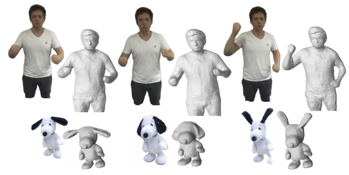

<p align="center">

  <h1 align="center">Neural Surface Reconstruction of Dynamic Scenes with Monocular RGB-D Camera</h1>
  <p align="center">
    <a href="https://mirgahney.github.io/">Mirgahney Mohamed</a>
    ·
    Lourdes Agapito
  </p>
  <h2 align="center">3DV 2024</h2>
  <h3 align="center"><a href="https://arxiv.org/abs/2311.08159">Paper</a> | <a href="https://mirgahney.github.io//DynamicSurf.io/">Project Page</a> | <a href="">Poster</a></h3>
  <div align="center"></div>

<p align="center">
  <a href="">
    
  </a>
</p>

<p align="center">
We propose DynamicSurf, a model-free neural implicit surface reconstruction method for high-fidelity 3D modelling of <b>non-rigid surfaces</b> from <b>monocular</b> RGB-D video.
</p>
<br>


## Usage

### Data Convention
The data is organized as [NeuS](https://github.com/Totoro97/NeuS#data-convention)

```
<case_name>
|-- cameras_sphere.npz    # camera parameters
|-- depth
    |-- # target depth for each view
    ...
|-- image
    |-- # target RGB each view
    ...
|-- mask
    |-- # target mask each view (For unmasked setting, set all pixels as 255)
    ...
```

Here `cameras_sphere.npz` follows the data format in [IDR](https://github.com/lioryariv/idr/blob/main/DATA_CONVENTION.md), where `world_mat_xx` denotes the world-to-image projection matrix, and `scale_mat_xx` denotes the normalization matrix.

### Pre-processed Data
You can download a part of pre-processed [KillingFusion](https://campar.in.tum.de/personal/slavcheva/deformable-dataset/index.html) data [here](https://drive.google.com/file/d/1wQ4yB7r-a8sFkwB6bEJIDp14AhjG8g_B/view?usp=sharing) and unzip it into `./`.

<b><i>Important Tips:</i></b> If the pre-processed data is useful, please cite the related paper(s) and strictly abide by related open-source license(s).

### Setup
Clone this repository and create the environment (please notice CUDA version)
```shell
git clone https://github.com/Mirgahney/dysurf.git
cd dysurf
conda env create -f dysurf.yml
conda activate dysurf
```

<details>
  <summary> Dependencies (click to expand) </summary>

  - torch==1.8.0
  - opencv_python==4.5.2.52
  - trimesh==3.9.8 
  - numpy==1.21.2
  - scipy==1.7.0
  - PyMCubes==0.1.2

</details>

### Running
- **Training**
```shell
python train_eval.py
```

- **Evaluating pre-trained model**
Coming Soon

```shell
python pretrained_eval.py
```

### Data Pre-processing
Coming Soon

### Geometric Projection
Coming Soon
<!---
- **Compiling renderer**
```shell
cd renderer && bash build.sh && cd ..
```

- **Rendering meshes**

Input path of original data, path of results, and iteration number, e.g.
```shell
python geo_render.py ./datasets/kfusion_frog/ ./exp/kfusion_frog/result/ 120000
```
The rendered results will be put in dir ```[path_of_results]/validations_geo/```
-->

## Todo List
- [ ] More Pre-processed Data
- [ ] Code of Data Pre-processing
- [ ] Code of Geometric Projection
- [ ] Pre-trained Models and Evaluation Code
- [x] Training Code


## Acknowledgements
This project is built upon [NDR](), [Go-Surf](), and [NeuS](https://github.com/Totoro97/NeuS). Some code snippets are also borrowed from [IDR](https://github.com/lioryariv/idr) and [NeRF-pytorch](https://github.com/yenchenlin/nerf-pytorch). The pre-processing code for camera pose initialization is borrowed from [Fast-Robust-ICP](https://github.com/yaoyx689/Fast-Robust-ICP). The evaluation code for geometry rendering is borrowed from [StereoPIFu_Code](https://github.com/CrisHY1995/StereoPIFu_Code). Thanks for these great projects. We thank all the authors for their great work and repos.


## Contact
If you have questions, please contact [Mirgahney Mohamed](https://mirgahney.github.io/).


## Citation
If you find our code or paper useful, please cite
```bibtex
@misc{mohamed2023dynamicsurf,
      title={DynamicSurf: Dynamic Neural RGB-D Surface Reconstruction with an Optimizable Feature Grid},
      author={Mirgahney Mohamed and Lourdes Agapito},
      year={2023},
      eprint={2311.08159},
      archivePrefix={arXiv},
      primaryClass={cs.CV}
}
```

If you find our pre-processed data useful, please cite the related paper(s) and strictly abide by related open-source license(s).
